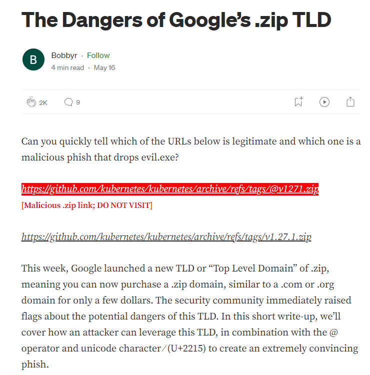

# .zip link validator

Used this medium article as a reference to detect malicious .zip links.

https://medium.com/@bobbyrsec/the-dangers-of-googles-zip-tld-5e1e675e59a5

.

The user script checks all links in the current webpage and checks if any .zip link is suspicious. Then, mark that link red, add a warning and turn off the clicking.

Note: This may slow down some pages if there are a lot of links available. This script does not cover all scenarios. 